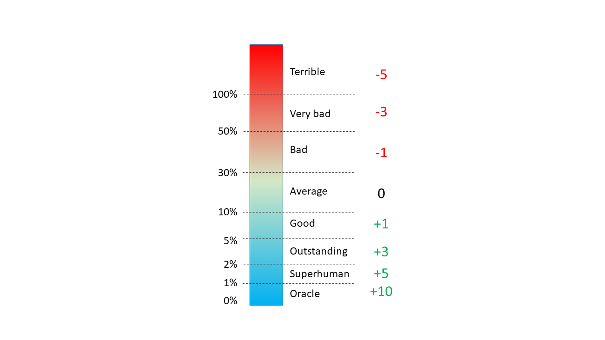

```{r preprocessing, echo=FALSE, message=FALSE, include=FALSE}
# Setting the parameters for the report
knitr::opts_chunk$set(echo = FALSE, warning = FALSE, fig.path = "figures/", fig.align='center', 
                      # dev = c('pdf', 'png'), 
                      pdf.options(encoding = "ISOLatin9.enc"))

# Libraries
library(tidyverse)
library(lubridate)
library(ggdark)
library(gridExtra)
library(knitr)
library(kableExtra)
# library(formattable)


source('comparison_week2.R')
```

> "I don't picture women in football, I'm sorry but this is my thinking" - Gennaro Gattuso 

# Introduction 

We have used the prediction of previous week and compare them against the Johns Hopkins official data taken from their website (https://www.worldometers.info/coronavirus/)
at around noone. The official numbers are shown bellow. 

```{r}
stat <- tidyr::spread(stat_df, type, count)
kable(stat, caption = "Official numbers for COVID-19 total cases and total death for different countries. ")
```

Next figure shows the predicted values (Y-axis) against the official numbers (X-axis).  

```{r, fig.width=8, fig.height=7}
p_scatter
```


# Calculating errors 


## Normalized error 

It's also interesting to normalize the error. Instead of large numbers (like US) determines the final ranking, we can try to normalize the errors. 
In this way, we are making all the predictions comparable. 

$$ 
e = \frac{y - \hat{y}}{y} = 1 - \frac{\hat{y}}{y} 
$$ 

For simplicity in understanding the numbers, they were converted to percentage. 

```{r, fig.height=6.2, fig.width=7}
p_latest_error
```

We can also quantify the total error for each category (total cases and death numbers), separately. This may show different ranking to each predictions. 

```{r , fig.height=12, fig.width=7}
gridExtra::grid.arrange(p_latest_error_total, p_latest_error_death, nrow = 2)
```

## Final results
Therefore, here is the final ranking:

```{r results='asis'}
# players ranking 
tbl <- df %>% 
  filter(date == !!latest_date) %>% 
  group_by(name) %>% 
  summarise(total_error = round(mean(abs(normalized_error * 100)), 2)) %>% 
  arrange(total_error) %>% 
  mutate(rank = row_number()) %>% 
  select(Ranking = rank, Name = name,`Average error` = total_error)
  
tbl %>% 
  kableExtra::kable(caption = "Participants ranking") %>% 
  kableExtra::kable_styling(bootstrap_options = "striped", full_width = TRUE, font_size = 16) %>% 
  kableExtra::row_spec(1, bold = T, background = "#c4ffd4") %>% 
  kableExtra::row_spec(5, bold = T, background = "#ffcfcf") 

```

# Pessimism 
Next we can rank the players by the sum of errors ($\sum_i e_i$). It's an indication of 
pessimism, if this value is negative. Therefore, we are ranking players based on their 
level of negativeness! 

```{r}
# most pessimistic player 
tbl <- df %>% 
  filter(date == !!latest_date) %>% 
  group_by(name) %>% 
  summarise(
    mentality = round(mean(normalized_error * 100), 2)) %>% 
  arrange(mentality) %>% 
  mutate(rank = row_number()) %>% 
  select(Ranking = rank, Name = name, Mentality = mentality)

kable(tbl, caption = "Participants ranking according to their pessimism")
```

# Predictions over time 
We have plotted the average error across time. With 53 points increase in performance, Saeedi is the best *learner*. 
Pedomi with only 21 points increase is the worst learner. 

```{r}
p_timeline
```

# Countries

## Player ranking by country

For each country, we have separately ranked players. Bellow how each player performed on each country (x-axis).

```{r , fig.height=6, fig.width=9}
p_countries
```

We can also see the actual prediction errors:

```{r , fig.height=6, fig.width=9.6}
p_country_error
```

## Ranking countries by difficulty 

Table bellow shows the ranking of countries by the level of difficulties. 

```{r}
# ranking countries by difficulty  ----------------------------------------

tbl <- df %>% 
  # filter(date == !!latest_date) %>% 
  group_by(country) %>% 
  summarise(
    total_error = round(mean(abs(normalized_error) * 100), 2), 
    mentality = round(mean(normalized_error) * 100, 2)
            ) %>% 
  mutate(rank = rank(total_error))  %>% 
  select(Ranking = rank, Country = country, `Average error` = total_error, Mentality = mentality)

kable(tbl, caption = "Ranking countries by the total error. From hardest to easiest.")
```


# Type 
## Prediction error Death vs. Total cases
Prediction error between death and total cases were fairly similar. However, death seemed to be slightly more difficult. 

```{r}
tbl <- df %>% 
  # filter(date == !!latest_date) %>% 
  group_by(type) %>% 
  summarise(
    total_error = round(mean(abs(normalized_error) * 100), 2), 
    mentality = round(mean(normalized_error) * 100, 2)
            ) %>% 
  mutate(rank = rank(total_error))  %>% 
  select(Ranking = rank, Type = type, `Total error` = total_error, Mentality = mentality)

kable(tbl)


```

# Best and worst predictions
First, best predictions: 
```{r}

tbl <- df %>%
  filter(date == !! latest_date) %>% 
  arrange(abs(normalized_error)) %>% 
  select(name, country, type, prediction, actual_count = count, error = normalized_error) %>% 
  mutate(error = round(error*100, 2)) %>% 
  head(5)


kable(tbl, caption = "Best predictions of the week") %>% 
  kable_styling(bootstrap_options = "striped", full_width = F, font_size = 15) 

```

Next, we show the worst predictions of the week: 

```{r}
tbl <- df %>%
  filter(date == !! latest_date) %>% 
  arrange(desc(abs(normalized_error))) %>% 
  select(name, country, type, prediction, actual_count = count, error = normalized_error) %>% 
  mutate(error = round(error*100, 2)) %>% 
  head(5)


kable(tbl, caption = "Worst predictions of the week") %>% 
  kable_styling(bootstrap_options = "striped", full_width = F, font_size = 15) 
```


# Table 


```{r}
fixture_tbl %>% 
  # mutate(
  #   Points = ifelse(Points >= 0, 
  #                   cell_spec(disp, "html", color = "red", bold = T),
  #                   cell_spec(disp, "html", color = "green", italic = T))
  # ) %>% 
  kable(caption = "Ranking table") %>% 
    kable_styling(bootstrap_options = "striped", full_width = F, font_size = 12) %>% 
    row_spec(1, bold = T, background = "#c4ffd4") %>% 
    row_spec(7, bold = T, background = "#ffcfcf") %>% 
    column_spec(5, width = "3cm") # %>% 
    # add_header_above(c(" ", "Badgest" = 8))
    
  
```

# Next week
We will select up to five countries from the list bellow. This list is genearted by the machine, selecting 15 random countries. 

```{r echo=TRUE}
# List of countries
library(countrycode)

set.seed(20201118)

countries <- codelist$country.name.en
selected_countries <- sample(countries, 15)

print(selected_countries)
```
Next week's challenge: 

* Portugal 
* United Kingdom
* Iran

# Apendix A: Scoring system 

